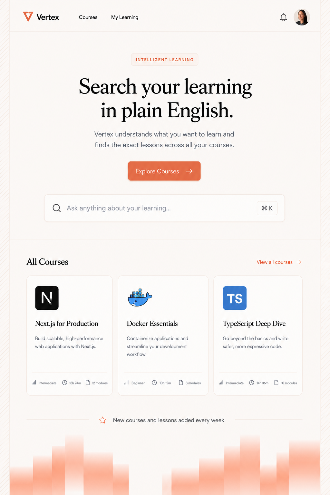
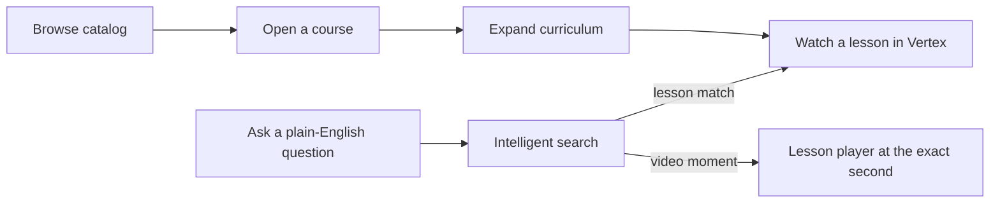
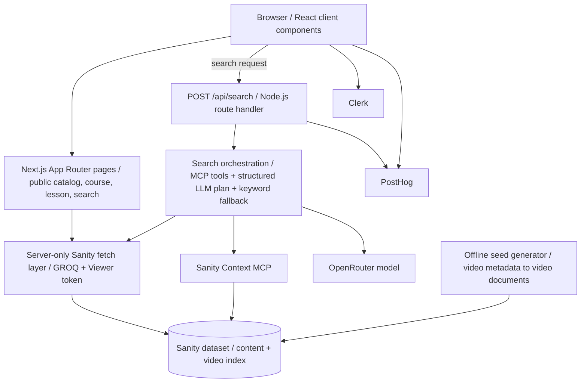
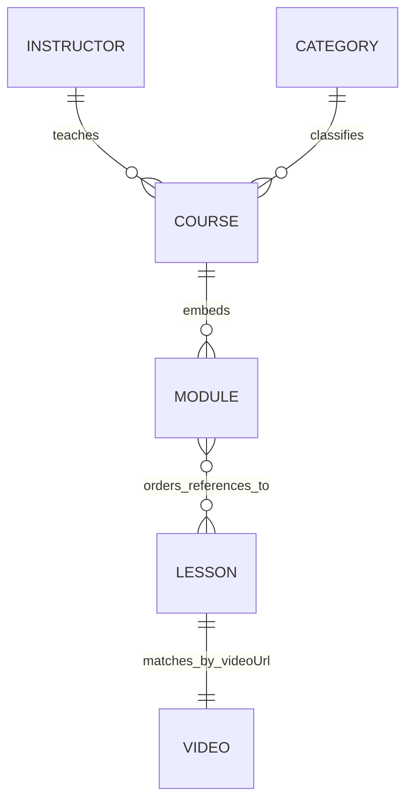

# Vertex

> **Learn in plain English.** Vertex is an AI-powered learning platform that turns a question into the right course, lesson, or exact point in a lesson video.

Vertex combines an editorial learning catalog with intelligent, grounded search. Content authors manage courses in Sanity; learners browse a polished catalog, explore course curricula, and watch YouTube lessons without leaving the product. A natural-language search can take a learner straight to a matching moment in a video.



## At a glance

| | |
| --- | --- |
| **Catalog** | Browse Sanity-managed courses, instructors, categories, and ordered lesson modules. |
| **Learning experience** | Expand course modules, open lessons, use in-page YouTube playback, browse notes and resources, and bookmark items in the UI. |
| **Intelligent search** | Search courses and lessons with Sanity Context MCP, an LLM planner, keyword fallback, and timestamp-aware video matches. |
| **Content intelligence** | Internal video documents map a lesson URL to chapter markers and timestamped transcript chunks. |
| **Identity & insights** | Clerk handles sign-in/sign-up; PostHog captures privacy-aware product and learning events. |

## Product experience



- **Home and catalog:** curated course cards link directly to the full catalog and individual courses.
- **Course pages:** course summary, instructor and category metadata, outcomes, an expandable module curriculum, and a Continue Learning action.
- **Lesson pages:** an embedded player, lesson navigation, notes, key points, resources, a bookmark control, and in-site links between lessons.
- **Search:** from the home page, the strongest matching video moment opens immediately at its returned timestamp. The full search page groups grounded lesson and video-moment matches, shows result counts, and supports sorting.
- **Learning signals:** bookmark, module, lesson, resource, tab, playback, watch-depth, completion, resume, and search interactions are instrumented for product analytics. Course progress is currently a display affordance; per-user persistence is not yet implemented.

## Design

Vertex follows the supplied desktop references in [`design/`](design/): a warm off-white canvas, refined serif headlines, restrained blue-gray body copy, orange calls-to-action, editorial cards, and thin rounded borders. The implementation keeps that visual language while adapting the catalog, course page, and lesson workspace into single-column layouts at smaller widths.

| Home | Course | Lesson | Search |
| --- | --- | --- | --- |
| [`vertex-home.png`](design/vertex-home.png) | [`vertex-course.png`](design/vertex-course.png) | [`vertex-lesson.png`](design/vertex-lesson.png) | [`vertex-search.png`](design/vertex-search.png) |

## Technology

| Area | Technology | Role in Vertex |
| --- | --- | --- |
| Application | Next.js 16, React 19, App Router | File-system routing, server rendering, client interactions, and route handlers. |
| Language | TypeScript | Typed application, schema, analytics, and search contracts. |
| Styling | Tailwind CSS 4, custom responsive CSS | Utility tooling plus the detailed product styles. |
| Content platform | Sanity 5, Sanity Studio, `next-sanity`, `@sanity/image-url`, Vision | Structured authoring, GROQ queries, images, content inspection, and the Studio route. |
| Search intelligence | Vercel AI SDK, `@ai-sdk/mcp`, `@ai-sdk/openai`, Sanity Context MCP, OpenRouter | Grounded search planning over the content schema. |
| Validation | Zod | Validates search requests and the structured LLM result plan. |
| Authentication | Clerk | Sign-in/sign-up and server-side user identity for analytics. |
| Analytics | PostHog browser SDK and Node SDK | Browser interaction events plus server-side search outcome events. |
| Video | YouTube privacy-enhanced embeds | In-site playback and start-time seeking. |
| Quality & tooling | ESLint, npm, Git | Linting, package scripts, and version control. |

## Architecture



### Boundary rules

- **Browser:** renders public learning content, submits search requests, plays embedded video, and sends browser analytics. It never receives a Sanity read token or OpenRouter key.
- **Next.js server:** reads the private Sanity dataset, authenticates the current Clerk user when available, runs the MCP/LLM search process, and captures server search outcomes.
- **Sanity:** owns read-only editorial content for the site and the internal search index. Its video documents are lookup data, never standalone learner results.
- **Offline tooling:** derives search documents from the supplied video metadata; it does not run during a learner request.

## Content model



| Type | Purpose |
| --- | --- |
| `course` | Top-level learning product: title, slug, marketing data, cover, level, outcomes, instructor, category, and ordered modules. |
| `courseModule` | Embedded course object with a title, summary, and ordered references to lessons. Module and lesson numbering comes from this order. |
| `lesson` | Reusable lesson document with a video URL, duration, thumbnail, Portable Text notes, key points, resource links, and preview metadata. |
| `instructor` | Name, photo, expertise, bio, and slug for course attribution. |
| `category` | A reusable course taxonomy with title, slug, and description. |
| `video` | Internal search index keyed to a unique video URL, containing chapter labels and short timestamped transcript chunks. |
| `sanity.agentContext` | The `vertex-search` Context configuration: dataset scope and search-specific query guidance. |

## How intelligent search works

1. A learner submits a natural-language query from the home or search page.
2. The browser calls `POST /api/search`; the route validates the query with Zod and identifies the Clerk user when one exists.
3. The server loads Sanity Context schema guidance and exposes its read-only MCP tools to the configured OpenRouter model.
4. The model returns a **structured plan**, not display prose: Sanity lesson IDs and, when applicable, exact video start seconds.
5. A tokenized GROQ keyword search supplements the plan so usable lesson and video matches remain available even when the LLM plan is incomplete.
6. Vertex resolves every candidate back to real Sanity documents. A chapter label match is preferred; transcript chunks are used only as a fallback.
7. The UI receives only grounded lesson and video-moment cards. A video card links to `/lessons/[slug]?start=<seconds>`, where the embedded player starts in place at that point.

The search service intentionally never returns an entire transcript, raw video index, fabricated timestamp, or invented course metadata.

## Routes

| Route | Description |
| --- | --- |
| `/` | Home page with featured learning and direct intelligent search. |
| `/courses` | Complete course catalog. |
| `/courses/[slug]` | Course landing page with outcomes and expandable curriculum. |
| `/lessons/[slug]` | In-site lesson player, notes, resources, and adjacent lesson navigation. Accepts `?start=<seconds>` for timestamp-aware playback. |
| `/search?q=<query>` | Full intelligent-search results experience. |
| `/sign-in/[[...sign-in]]` | Clerk sign-in flow. |
| `/sign-up/[[...sign-up]]` | Clerk sign-up flow. |
| `/studio` | Sanity Studio authoring surface. |
| `POST /api/search` | Server-only intelligent search endpoint. |

## Local development

### Prerequisites

- Node.js compatible with Next.js 16
- npm
- A Sanity project/dataset and Viewer token
- A Clerk application
- An OpenRouter API key and supported model for intelligent search
- Optional PostHog project credentials for analytics

### Start the app

```bash
npm install
cp .env.example .env.local
npm run dev
```

Open [http://localhost:3000](http://localhost:3000).

On PowerShell, copy the example environment file with:

```powershell
Copy-Item .env.example .env.local
```

### Available commands

```bash
npm run dev                    # Start the local Next.js development server
npm run lint                   # Run ESLint
npm run build                  # Create a production build
npm run start                  # Serve the production build
npm run generate:search-seed   # Generate the derived video index and Context document
```

## Environment configuration

Copy [`.env.example`](.env.example) to `.env.local`. Keep `.env.local` private and never commit it.

| Group | Variables | Purpose |
| --- | --- | --- |
| Clerk | `NEXT_PUBLIC_CLERK_PUBLISHABLE_KEY`, `CLERK_SECRET_KEY` | Browser-safe Clerk key and server-only Clerk secret. |
| PostHog | `NEXT_PUBLIC_POSTHOG_PROJECT_TOKEN`, `NEXT_PUBLIC_POSTHOG_HOST` | Browser analytics configuration; the project token is public by design. |
| PostHog server | `POSTHOG_SERVER_API_KEY`, `POSTHOG_HOST` | Optional server-side capture of search outcome events. |
| Sanity | `NEXT_PUBLIC_SANITY_PROJECT_ID`, `NEXT_PUBLIC_SANITY_DATASET`, `NEXT_PUBLIC_SANITY_API_VERSION`, `SANITY_API_READ_TOKEN` | Project configuration plus the server-only Viewer/read token. |
| Intelligent search | `SANITY_CONTEXT_SLUG`, `SANITY_CONTEXT_MCP_URL`, `OPENROUTER_API_KEY`, `OPENROUTER_MODEL` | Context document selection, optional explicit MCP endpoint, and server-only LLM configuration. |

`SANITY_CONTEXT_MCP_URL` is optional: when absent, Vertex derives the HTTPS MCP endpoint from the Sanity project, dataset, and `SANITY_CONTEXT_SLUG`.

## Sanity seed and video-index workflow

The provided source files are inputs and are never modified:

- `app/studio/[[...tool]]/seed/seed.ndjson`
- `app/studio/[[...tool]]/seed/videos.json`

Generate the derived video documents and the `vertex-search` Context document:

```powershell
npm run generate:search-seed > sanity/seed/vertex-search.ndjson
```

After deploying the schema and Studio application, import the generated file into the configured dataset:

```powershell
npx sanity dataset import sanity/seed/vertex-search.ndjson production --replace
```

The generated import contains 120 video records and one Context configuration record. Re-run the generator before each import so the index remains derived from the supplied video metadata. See [`sanity/seed/README.md`](sanity/seed/README.md) for the focused seed instructions.

## Analytics and privacy

PostHog tracks product engagement with a consistent event vocabulary, including search performed/results opened, course and module exploration, lesson selection, video play, watch-depth milestones, resume use, completion, bookmarks, tabs, and resource opens.

- The browser only uses public PostHog configuration.
- The search route sends best-effort server events only when a server PostHog key is configured.
- Search analytics record normalized query details only when they do not resemble an email address, phone number, or long numeric identifier; otherwise the query is redacted while aggregate length and word-count data remain available.
- Clerk user IDs can identify analytics events; no other personally identifiable content is intentionally captured by the search instrumentation.
- Sanity and OpenRouter credentials stay in server-only environment variables. Public pages cannot write Sanity content or call the MCP/LLM directly.

## Verification

Run the standard checks after application changes:

```bash
npx tsc --noEmit
npm run lint
npm run build
```

Manual search smoke test:

1. Start the app with valid Sanity and OpenRouter configuration.
2. Open the home page and search for `agent skills`.
3. Confirm Vertex opens a real lesson in the in-site player with a `?start=<seconds>` value when a matching video moment exists.
4. Open `/search?q=agent%20skills` and confirm cards map to real course and lesson content.
5. Confirm the browser console does not expose Sanity or OpenRouter secrets.

## Repository map

```text
app/                    Next.js routes, page components, API handler, analytics
sanity/                 Schema, GROQ access layer, search orchestration, seeds
scripts/                Offline video-index generation
design/                 Product UI reference images
prompts/                Approved implementation records
proxy.ts                Clerk middleware configuration
sanity.config.ts        Sanity Studio configuration
.env.example            Canonical list of required environment variables
```

---

Vertex is designed as a focused learning product: authored content in, grounded answers out, and the learner always stays in the experience.
